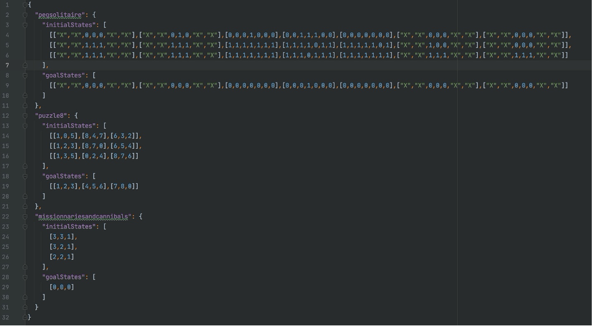
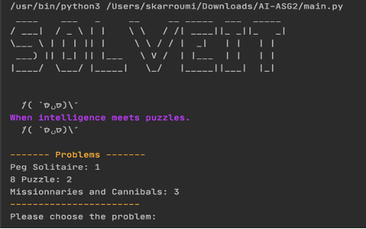
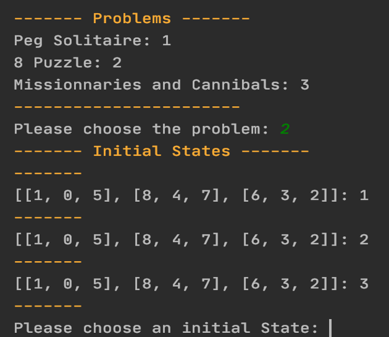
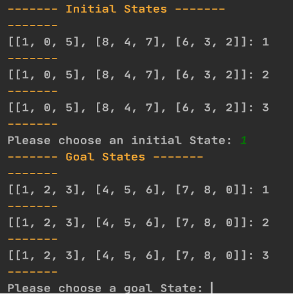
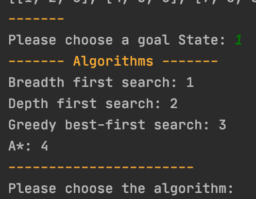
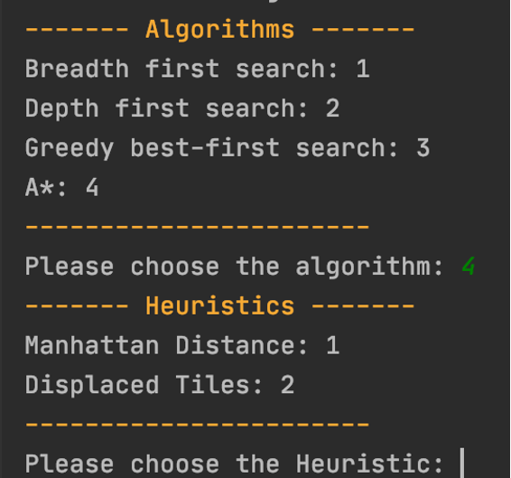
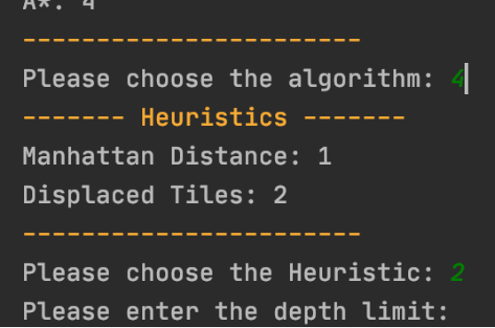
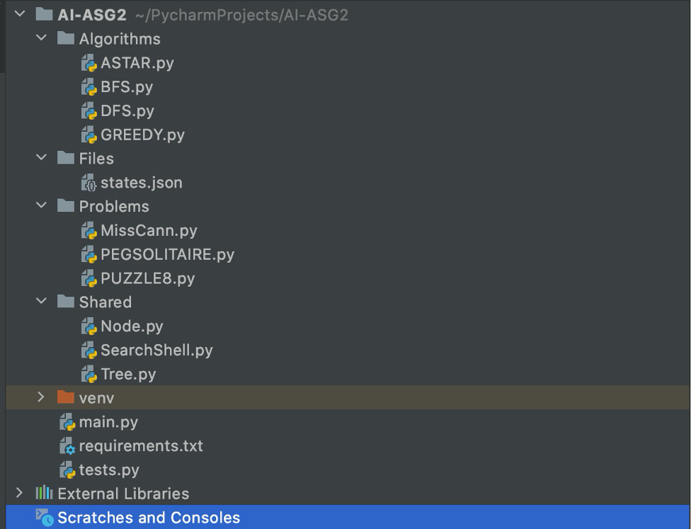

#
# SOLVEIT

# Table of Contents

**[1 - Programming Language and Version ](#_Toc56806974)**

**[2 - Configuration File and other input arguments ](#_Toc56806975)**

**[3 - Compile and Run ](#_Toc56806976)**

**[4 - Program Testing with different puzzles ](#_Toc56806977)**

**[5 - Separation between what belongs to the search shell and what is puzzle specific ](#_Toc56806978)**

#

# Programming Language and Version

This program is written in Python version 3.6, however, it should run fine with recent versions of Python 3 (Tested with 3.6 and 3.8).

# Configuration File and other input arguments

The project root folder contains a &quot;Files&quot; folder which too contains a states.json file, in this file there are some default values for initial states and goal states for all the 3 puzzles, when the program is running, these default values show up to the user to choose from.

However, for flexibility and scalability purposes, the Json file can be modified any time before running the program to add different initial states and goal states for the puzzles.

Note:

The Json file is the only external file and argument the program requires, choice of the problem, algorithm, heuristic and other inputs (depth limit…) are supplied at runtime.

#

# Compile and Run

In case the initial and goal states for a problem are already existing in the Json file, no modification shall happen to that file, otherwise, manually insert the initial and goal state values in the Json file before running the program.

1. Install Python 3.8
2. Open the terminal and go to the root folder of the project
3. Install the prerequisites using the following command:

pip3 install -r requirements.txt

4. **Running the code**

4.1 Using IDE (Preferably PyCharm, because it will display the colors):

  1. Open the project with the Python IDE of your choice.
  2. run main.py

4.4 Using Terminal:

  1. Open terminal and change directory to point to the project root folder
  2. Enter &quot;python main.py&quot;

If you&#39;re familiar with the venv you can use it instead of installing the requirements by doing the following:

  1. Open terminal and navigate to the root folder of the project
  2. Execute the following command: &quot;source venv/bin/activate&quot;

# Program Testing with different puzzles

1. Upon running the main.py, the user is prompted to choose from the 3 puzzles (problems). The choice is done this way:

- For Peg Solitaire, user must enter 1
- For 8 Puzzle, the user must enter 2
- For Missionaries and Cannibals, the user must enter 3

2. After choosing the problem, the initial states for the chosen problem are loaded from the json file

3. Now the user has to choose the desired goal state

4. Choosing the algorithm to solve the problem (in the Case of choosing GBFS or A\*, the user is then prompted to choose the heuristic)

5. Heuristic Choice (Heuristic choice is only shown in the case of A\* and GBFS)

6. The last thing the user is prompted to input is the depth of the search, that is how many nodes must be expanded, if a solution is not found when reaching the depth value, the user is again prompted to choose whether he&#39;d like to re-expand again or no

Note: in case of not wanting to limit the search to a number of expansions, the user must input 0 and the search will not stop until the program finishes

7. Finally, the user has to hit enter and the program shall do the rest; showing frontier, repeated states, nodes expansions, illegal states, time taken to solve the puzzle and displaying the entire path from initial to goal state

# Separation between what belongs to the search shell and what is puzzle specific

As shown in the figure above, which illustrates the project structure, all the search algorithms are gathered in the Algorithms folder, and the Puzzles are in the Problems folder.

However, we set up a shared folder which contains Node.py that is a parent class for the 3 Puzzles. And In order to abstract the manipulation of Problems&#39; nodes, we implemented a Tree that provides the needed functions such as addFrontier(), executeSuccessorFunction(), addExploredNode()… the Tree also guarantees data persistency by creating single instance of the tree that holds all the attributes such as Frontiers, ExploredSet.

Tree is considered as a shared element between the SearchShell and the problems since the algorithms take a tree as an argument to manipulate the data according to the search specifications.
